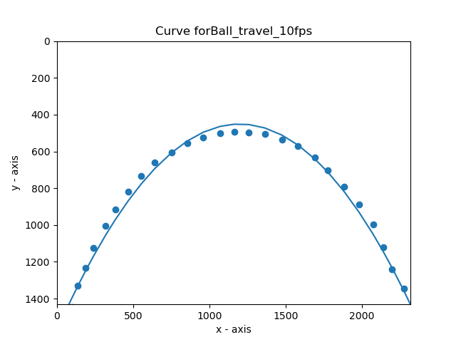
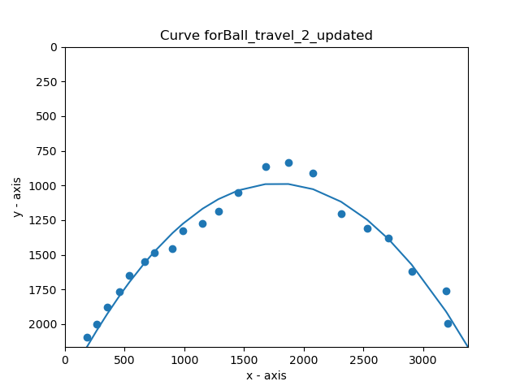
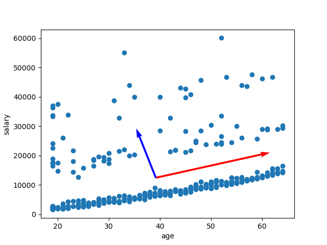
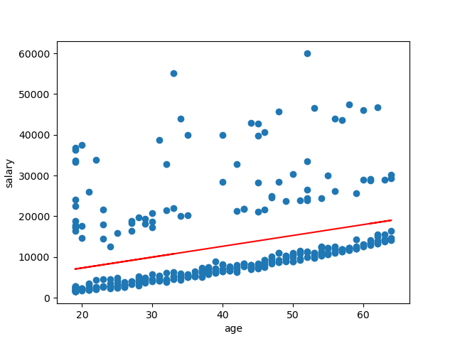
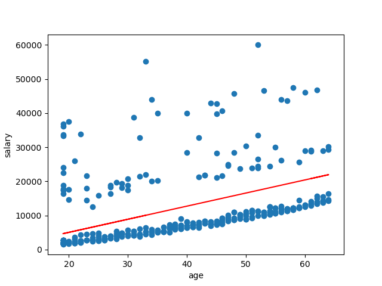
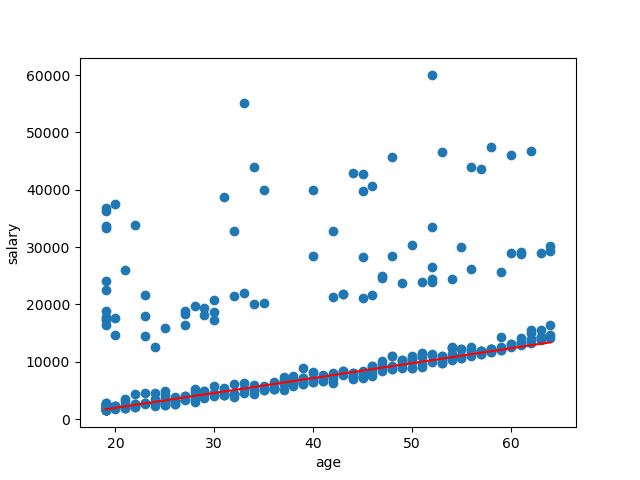

# Curve Fitting and Homography
The report of this project can be found [here](https://github.com/aditiramadwar/Curve-Fitting-and-Homography/blob/main/Report.pdf)
#### Clone the project:
    git clone https://github.com/aditiramadwar/Curve-Fitting-and-Homography.git

All the plots are saved in /results folder. While running the files, exit any of the plots by pressing the 'q' key
## Problem 1
The solution of this problem can be found [here](https://github.com/aditiramadwar/Curve-Fitting-and-Homography/blob/main/Report.pdf)
## Problem 2
#### 1. Save data from videos
	 python3 2_data_points.py
This will save data points in a txt file in the /results folder

#### 2. Plot Least Square curve fitting graphs
    python3 2_LS_plot_curve.py
This will plot the Least square graphs, press 'q' key to close the window to get to the next plot.
  
## Problem 3
#### 1.  Calculate the covarience matrix and plot the eigen vectors on the data
    python3 3_eigen.py
    
   
#### 2. Plot Least Square curve fitting graphs
    python3 3_LS.py
    
   
#### 3. Plot curve using Total Least Square method

    python3 3_TLS.py
    
   
####  4. Plot curve using RANSAC method

    python3 3_RANSAC.py
    
 
## Problem 4
Get the homography matrix

    python3 4_homography.py

